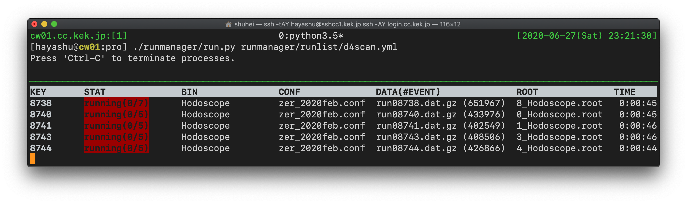

K1.8 analyzer README
====================

2020.06.27 Add runmanager  
2020.03.12 First made

It is assumed to work on KEKCC, Scientific Linux release 6.10 (Carbon).

## Environment variables

Add the following lines to your .bashrc.

```a
module load git/2171
module load gcc/485
module load python/2.7
module load python/3.5
. /sw/packages/root/6.14.06/bin/thisroot.sh
export PATH=$PATH:$HOME/unpacker/bin # Set as appropriate
```

## Unpacker

Install the Unpacker.

```a
$ git clone \
ssh://sks@www-online.kek.jp:8022/~/public_html/git/unpacker.git
$ cd unpacker/src
$ cp Makefile.org Makefile
$ make
```

Check if the "unpacker-config" command is available.

```a
$ unpacker-config --version
2020-01-21
```

## K1.8 analyzer

Install the K1.8 analyzer.

```a
$ git clone \
ssh://sks@www-online.kek.jp:8022/~/public_html/git/k18-analyzer.git
$ cd k18-analyzer
$ git checkout e42
$ cp Makefile.org Makefile
$ make
```

e.g.) Hodoscope,
Usage: Hodoscope [analyzer config file] [data input stream] [output root file]

```a
$ ./bin/Hodoscope param/conf/analyzer_2019apr_0.conf \
/group/had/sks/E40/JPARC2019Feb/e40_2019feb/run07334.dat.gz hoge.root
```

### runmanager

__runmanager__ is a script for managing jobs on KEKCC.
Prepare runlist.yml by referring to the example.yml.
Note that the indentation determines the nest depth in yaml.

```yml
#
# RUN LIST (YAML format)
#
# The allowed keys are
#   queue  <- bsub queue (eg. s, l, etc...)
#   unit   <- dividing event unit
#   nporc  <- number of process for merging
#             (must be less than 20)
#   buff   <- intermediate root files will be placed here
#             if nproc is more than 2
#   bin    <- path to executable binary
#   conf   <- path to conf directory/file from the work directory
#   data   <- path to data directory/file
#   root   <- path to the output ROOT output directory/file
#
# Be careful of the indent rule
# because YAML format is sensitive to it.
# Some problems will happen
# if there is no default setting declaration.
#

#____________________________________________________
# work directory path
# The following paths must be relative to this path

WORKDIR: ~/k18analyzer/pro

#____________________________________________________
# default setting
# default setting MUST have all items.
# This setting will be inherited unless you explicitly set values
# for the individual cases.

DEFAULT:
  queue: s
  unit:  100000
  nproc: 1
  buff:  /group/had/sks/Users/user/buffer
  bin:   ./bin/Hodoscope
  conf:  ./param/conf/analyzer_default.conf
  data:  ../data
  root:  ../rootfile
#____________________________________________________
# Individual settings
# If you want to adapt the default setting to some runs,
# you only have to list keys.

RUN:

  test: # Any keys are OK unless it overlaps.
    bin:  ./bin/Hodoscope
    conf: ./param/conf/analyzer_default.conf
    data: ./test.dat.gz
    root: ./test.root

  3838:
  # The default setting will be adapted.
  # In this case run03838.dat(.gz) will be loaded.

  3800: # ./param/conf/analyzer_03800.conf will be loaded.
    bin:  ./bin/KuramaTracking
    conf: ./param/conf
    data: ./tmp_data

  hodo:
    data: ../data/run03800.dat.gz
```

Run run.py.
Note that the process runs until all jobs have finished.
Ctrl-C kills all jobs and terminates the process.

```a
$ ./runmanager/run.py runmanager/runlist/foo.yml
```

Run monitor.py on another tty to see the progress of the jobs.
The job status is updated in the "stat" directory, using the same name as the runlist in json format.

```a
$ ./runmanager/monitor.py runmanager/stat/foo.json
```


